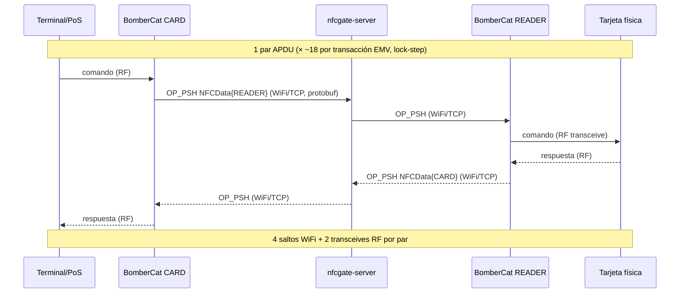
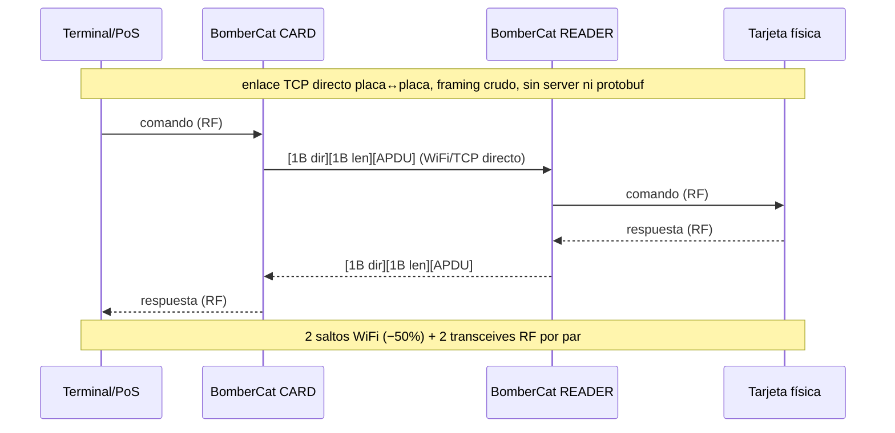

# Rediseño de la arquitectura de comunicación RP2040 ↔ ESP32 ↔ servidor

> Estado: **propuesta / análisis** · Creado: 2026-08-19
> Contexto obligatorio antes de leer esto: [`LATENCIA_OPTIMIZACION.md`](LATENCIA_OPTIMIZACION.md)
> (bitácora validada en HW, FW 0.9.7). Este documento **no repite** ese trabajo; parte de sus
> mediciones para responder a una petición de rediseño y separar lo que **sí** baja latencia de lo
> que no.

---

## 0. TL;DR — veredicto honesto

La petición pedía: eliminar el overhead de WiFiNINA, cambiar la serialización (CBOR/MessagePack/JSON
comprimido), reducir metadata del payload y hacer *buffering* para transacciones batch.

Leyendo el código real y la bitácora de latencia validada en HW, la conclusión es incómoda pero
clara: **ninguna de esas cuatro palancas mueve la aguja en este problema**, y una de ellas
(*batching*) es imposible por la naturaleza de EMV. Lo que **ya** bajó la latencia de ~15 s a ~4.5 s
fueron cambios de otra clase (Nagle en el server, dead-time por-APDU en la ruta RF, lectura en bloque
del header SPI). Ver §2.

**El único rediseño que rompe el piso arquitectónico** es un **modo directo placa↔placa** que
*rompe* la compatibilidad con NFCGate a cambio de eliminar 2 de los 4 saltos de red y todo el
protobuf. Es opt-in y convive con el modo NFCGate actual. Ver §5. Todo lo demás es marginal.

Si tu objetivo real es **latencia**, salta a §2 y §5. Si es **mantenibilidad/OTA**, a §7.

---

## 1. Cómo funciona hoy la comunicación (código real)

Tres enlaces en serie, no dos. Es clave no confundirlos:

```
[RP2040]  --SPI-->  [ESP32-WROOM]  --WiFi/TCP-->  [nfcgate-server]  --WiFi/TCP-->  [peer]
 lógica            coprocesador NINA              relay Python                    (otra placa
 del relay         (firmware Espressif)           TCP_NODELAY                      o app NFCGate)
```

- **RP2040 ↔ ESP32:** El ESP32 **no** ejecuta nuestro código; corre el firmware **NINA** de
  Espressif y actúa como **coprocesador WiFi por SPI**. `WiFiNINA` es la librería *del lado RP2040*
  que lo maneja. Por eso cada `WiFiClient::read()`/`available()` es **una transacción SPI completa**
  contra el ESP32, no una lectura de RAM local ([`NfcGateLink.cpp`](core/src/NfcGateLink.cpp),
  `poll()`).
- **ESP32 ↔ server ↔ peer:** protocolo NFCGate: framing con prefijo de longitud + protobuf
  (`nanopb`). Formato asimétrico ([`NfcGateCodec.h`](core/src/NfcGateCodec.h)):
  - cliente→server: `[4B len BE][1B session][payload]`
  - server→cliente: `[4B len BE][payload]`
  - `payload = ServerData{ opcode, data = NFCData{...} }` — `NFCData.data` lleva el APDU crudo.

Una transacción EMV real = **~18 pares de APDU estrictamente lock-step** (el terminal no emite el
comando N+1 hasta recibir la respuesta N). Cada par recorre **4 saltos WiFi** vía el server:

```
terminal → card(RF) → WiFi → server → WiFi → reader → RF → tarjeta → (de vuelta)   × 18
```

### 1.1 Tamaño real del payload (mata el argumento de la serialización)

Con `NFCData.data` = 512 B de capacidad y `ServerData` serializado ≤ 605 B (de los headers nanopb),
pero para un APDU EMV corto los números reales son:

| Elemento | Bytes |
|---|---|
| APDU crudo (p.ej. SELECT PPSE) | ~20 |
| Overhead protobuf `NFCData` (data_source, data_type, tag+len) | ~8–12 |
| Overhead `ServerData` (opcode, tag+len del data anidado) | ~4–6 |
| Framing (`len` 4B + `session` 1B) | 5 |
| **Total en el cable** | **~40 B** |

**El frame ya es diminuto.** El cuello de botella nunca fue el ancho de banda; es la **latencia de
ida y vuelta** (RTT × 4 saltos × 18 pares) y la **física RF**. Cambiar protobuf por CBOR/MessagePack
ahorraría **~5–10 B por frame** sobre un enlace WiFi que mueve eso en microsegundos: **ganancia
≈ 0 ms**, a cambio de romper la compatibilidad con la app NFCGate. Ver §3.

---

## 2. Dónde se va el tiempo (medido y validado en HW — no supuesto)

De [`LATENCIA_OPTIMIZACION.md`](LATENCIA_OPTIMIZACION.md), todo confirmado en hardware:

| Fase | Cambio | Dónde | Resultado HW |
|---|---|---|---|
| A.2 | IRQ-gate del 2º receive del reader | RF (código propio) | robustez; no bajó el piso |
| D | ventana 2º-paquete 120→25 ms | RF (código propio) | **−1.5 s** (15 → 13.5) |
| C | quitar `writeData(255)` inútil en `cardModeReceive` | I2C/RF | recorte overhead |
| **E** | **`TCP_NODELAY` + write coalescido en el server** | **Red (Python)** | **el mayor: 13.5 → ~5 s** |
| F | header de 4B en **una** lectura SPI (no byte-a-byte) | **WiFiNINA/SPI** | **−0.5 s** (5 → 4.5) |
| G | ventana 25→10 ms | RF | marginal |
| H | silenciar logs por-frame del server | Red (Python) | marginal |

Lecturas clave para el rediseño:

1. **El overhead de WiFiNINA que era recortable, ya se recortó (Fase F).** El header se leía
   byte-a-byte = ~8 transacciones SPI/frame; hoy es una sola lectura en bloque. El payload ya se leía
   en bloque. Lo que queda del enlace SPI es **físico** (handshake slave-ready del NINA por
   transacción), no software recortable sin reemplazar el firmware del ESP32 (§5.2).
2. **El mayor recorte no estuvo en el firmware ni en la serialización: fue Nagle/delayed-ACK en el
   server (Fase E, −8.5 s).** Puro software Python, cero riesgo RF. Esto ya está aplicado
   ([`server/server.py`](../../server/server.py) `setup()`).
3. **El piso de ~4.5 s restante es causal y serial:** think-time del terminal + cripto de la tarjeta
   + transceives RF + 4 saltos WiFi × 18 pares lock-step. **No se paraleliza** (RTOS/hilos no ayudan:
   una cadena causal no se pipelinea). Solo se rompe **quitando saltos** (§5).

---

## 3. Evaluación punto por punto de las palancas propuestas

| Palanca propuesta | ¿Ayuda? | Por qué |
|---|---|---|
| **Eliminar overhead WiFiNINA** | Parcial, **ya hecho** | El recorte software (header en bloque) es la Fase F. Lo que queda es el handshake SPI físico del coprocesador NINA; solo se elimina reemplazando el firmware del ESP32 por uno propio (§5.2) — mucho trabajo, rompe compat. |
| **CBOR / MessagePack / JSON comprimido** | **No** | El frame ya es ~40 B; la serialización ahorra ~5–10 B irrelevantes frente a un enlace limitado por RTT, no por ancho de banda. Rompe compat NFCGate. Protobuf/nanopb ya es más compacto que CBOR para este esquema fijo. |
| **Reducir metadata redundante del payload** | **No** | Los únicos campos son `data_source`, `data_type` y el APDU. `data_source`/`data_type` son **semánticamente necesarios** (dirigen el ruteo cmd/resp y el parser de config del peer). No hay redundancia que quitar. |
| **Buffering / batch de transacciones** | **Imposible** | EMV es estrictamente **lock-step causal**: el comando N+1 no existe hasta que llega la respuesta N. No hay nada que agrupar; un buffer solo **añade** latencia. |
| **OTA** | Sí, pero es otra cosa | Feature de mantenibilidad, no de latencia. Ver §7. |

**Conclusión:** la petición apunta, de buena fe, al eslabón equivocado. El ancho de banda y la
serialización no son el problema; el problema es el **número de saltos por par de APDU** y la
**física RF**, y de esos solo el primero es atacable sin tocar el hardware.

---

## 4. Diagrama de flujo

### 4.1 Arquitectura actual (modo NFCGate — se conserva)



### 4.2 Modo turbo directo (propuesto, opt-in — §5.1)



---

## 5. El único rediseño que rompe el piso

### 5.1 Modo turbo directo placa↔placa (recomendado como *opt-in*)

**Idea:** para el caso de dos BomberCats (Camino A), saltarse el `nfcgate-server` y el protobuf. Una
placa abre un `WiFiServer` (TCP listen), la otra conecta directo. Framing mínimo:

```
[1B dir][1B len][len B APDU]     dir: 0x00=cmd (READER src), 0x01=resp (CARD src)
```

- **Elimina 2 de los 4 saltos WiFi por par** → potencial **~30–50 % de recorte del componente de
  red** del piso (el componente RF/cripto/think-time es intocable). Con red ≈ la mitad de ~4.5 s,
  el techo optimista queda en el orden de **~3–3.5 s**. *Estimación, a validar en HW.*
- **Elimina encode/decode protobuf** por frame (menor CPU/flash) y todo el SPI de framing extra.
- **Reutiliza** `RelayEngine` casi intacto: solo se sustituye el `NfcGateLink` por un
  `DirectLink` que implemente la misma superficie (`connect/send/poll/stop`). El `RelayEngine` no
  sabe de protobuf; habla en términos de `NfcSource` + bytes de APDU, así que el punto de corte es
  limpio.
- **Coste:** **rompe compat con la app NFCGate y el server**. Por eso es un **modo aparte**
  (`role=turbo-host` / `role=turbo-client`), seleccionable por el CLI, **no** un reemplazo. El modo
  NFCGate actual se queda como está para el Camino B (app Android).

**Trade-off explícito:** velocidad ↔ interoperabilidad. Turbo = más rápido pero solo BomberCat↔
BomberCat en la misma red/alcance. NFCGate = interoperable (app, plugins, relay remoto por Internet)
pero con los 4 saltos.

### 5.2 ESP32 como gateway "inteligente" (alternativa de mayor esfuerzo — **no recomendada ahora**)

Reflashear el ESP32 con firmware propio (no NINA) que hable el protocolo NFCGate hacia el server y
un protocolo compacto (SPI/UART) de solo-APDU hacia el RP2040. Movería el protobuf y el framing TCP
fuera del RP2040.

**Por qué no ahora:** el overhead SPI recortable **ya se recortó** (Fase F, −0.5 s), y lo que queda
del SPI es físico. Ganarías quizá **~100–200 ms** a cambio de: mantener dos firmwares, perder
`ESP32SerialPassthroughFlash` como está, reimplementar toda la pila NFCGate en el ESP32, y un riesgo
de regresión alto. **Relación esfuerzo/beneficio pésima.** Documentado aquí solo para cerrarlo como
opción evaluada y descartada.

---

## 6. Comparativa de rendimiento (esperada)

| Métrica | NFCGate actual (0.9.7) | Turbo directo (§5.1) | ESP32 gateway (§5.2) |
|---|---|---|---|
| Saltos WiFi por par | 4 | **2** | 4 |
| Serialización | protobuf/nanopb | framing crudo 2B | protobuf (en ESP32) |
| Overhead/frame | ~15–20 B | **2 B** | ~15–20 B |
| Compat app NFCGate | ✅ | ❌ | ✅ |
| Relay remoto por Internet | ✅ (via server) | ❌ (LAN/directo) | ✅ |
| Latencia/txn (medido / estimado) | **~4.5 s (HW)** | **~3–3.5 s (est.)** | ~4.3 s (est.) |
| Esfuerzo | — (ya existe) | **Medio** | Alto |
| Riesgo RF | — | Bajo (no toca RF) | Alto |

> Los números de "turbo" y "gateway" son **estimaciones a validar en HW** con el mismo método de la
> bitácora (timestamps + cronometraje del usuario). El piso RF/cripto/think-time (~2–3 s) es común a
> los tres y **no** se mueve por software.

---

## 7. OTA (mantenibilidad — pista independiente)

No baja latencia, pero sí facilita iterar. El RP2040 (Mbed OS) ya usa FlashIAP para `ConfigStore`;
OTA por WiFi del RP2040 es complejo (bootloader/particiones Mbed). Camino más barato y realista:

- **Turbo/NFCGate:** el firmware del RP2040 ya se actualiza por USB (arduino-cli / `bombercat`).
  Mantener eso; OTA del RP2040 es alto esfuerzo para poco retorno hoy.
- **ESP32:** ya existe [`ESP32SerialPassthroughFlash`](ESP32SerialPassthroughFlash/) para flashearlo
  vía el RP2040. Si algún día se hace §5.2, ahí sí OTA del ESP32 (`ArduinoOTA`/`Update.h`) tiene
  sentido.

Recomendación: **no invertir en OTA ahora**; no es el cuello de botella y añade superficie de fallo.

---

## 8. Dependencias y librerías

Sin cambios respecto a hoy para el modo turbo (§5.1), que es la recomendación:

- `BomberCatCore` (este repo) — se le añade `DirectLink` (nueva clase, ~una superficie de 4 métodos).
- `WiFiNINA` — se **conserva** (el turbo usa `WiFiServer`/`WiFiClient`, ya incluidos).
- `Electronic Cats PN7150` — sin cambios.
- nanopb (`pb_*`) — se conserva para el modo NFCGate; el turbo no lo usa.
- **Nada nuevo que instalar.** CBOR/MessagePack quedan descartados (§3), así que no se agregan libs.

Compilable en Arduino IDE / arduino-cli con el core
`electroniccats:mbed_rp2040:bombercat`, igual que hoy.

---

## 9. Instrucciones de migración (modo turbo, si se adopta)

Incremental y sin tocar el modo NFCGate existente:

1. **`DirectLink` en `core/src/`** — misma superficie pública que `NfcGateLink`
   (`connect/connected/send/poll/receive/stop/session`) pero con framing `[dir][len][APDU]` sobre un
   `Client&`. Sin protobuf. Testeable off-device igual que `NfcGateCodec` (host test en `tools/`).
2. **Rol de escucha** — en `role=turbo-host`, el sketch abre un `WiFiServer(port)` y entrega el
   `WiFiClient` aceptado a `DirectLink`; en `turbo-client`, conecta como hoy. `RelayEngine` no
   cambia: se le inyecta `DirectLink` en vez de `NfcGateLink` (ambos cumplen el mismo contrato).
3. **CLI/ConfigStore** — añadir los roles `turbo-host`/`turbo-client` a `RelayConfig::roleEnum()` y
   al parser del CLI. `server`/`session` se ignoran en turbo (o `server` = IP del host directo).
4. **Server** — no se toca; el turbo no lo usa.
5. **Validación en HW** — replicar el método de `LATENCIA_OPTIMIZACION.md`: correr N transacciones
   Camino A en turbo, cronometrar, comparar contra los ~4.5 s de NFCGate. Registrar el número real
   en esa bitácora antes de dar §5.1 por bueno.

Punto de reversión: como es un rol nuevo y una clase nueva, `git revert` del rol deja el firmware
NFCGate idéntico. Riesgo de regresión sobre lo existente ≈ nulo.

---

## 10. Respuestas a las tres preguntas

**1. ¿Qué estrategia de comunicación recomiendas y por qué?**
Para **interoperabilidad**: quedarte en NFCGate como está — ya está optimizado a ~4.5 s y las
palancas de software que quedaban (Nagle, header SPI) ya se aplicaron. Para **mínima latencia entre
dos BomberCats**: añadir el **modo turbo directo** (§5.1) como rol opt-in, que elimina 2 de los 4
saltos WiFi y el protobuf. Es el **único** cambio que ataca el piso sin tocar el hardware, reutiliza
`RelayEngine` intacto y no rompe el modo NFCGate. **No** cambiar la serialización ni intentar batch:
lo primero es irrelevante (frames de ~40 B) y lo segundo es imposible en EMV lock-step.

**2. ¿Cómo mantener la seguridad sin afectar el rendimiento?**
El relay NFC es en sí una herramienta ofensiva/de auditoría; "seguridad" aquí = **integridad del
canal y control de acceso al relay**, no cifrar el APDU (que debe pasar íntegro). Opciones baratas:
(a) en turbo, un **token/PSK** de 1 handshake al abrir el TCP (una sola vez por sesión, coste
amortizado a ~0 sobre 18 pares); (b) para NFCGate remoto, el server ya soporta **TLS** (`ssl` en
[`server.py`](../../server/server.py)) — el coste del handshake TLS es **una vez por sesión**, no por
APDU, así que no afecta la latencia por-transacción. **No** cifrar por-frame: añadiría coste al
hot-path lock-step por cero beneficio real (el contenido EMV no es secreto de largo plazo). Regla:
seguridad en el **borde de sesión**, nunca en el **hot-path por-APDU**.

**3. ¿Qué trade-offs considerar (velocidad vs funcionalidad)?**
- **Turbo vs NFCGate:** velocidad (~1–1.5 s menos, estimado) ↔ pierdes app Android, plugins del
  server y relay remoto por Internet. Por eso es opt-in, no reemplazo.
- **Piso físico:** ~2–3 s de RF + cripto + think-time del terminal son **irreducibles** por
  software. Gestionar expectativas: ni turbo ni RTOS bajan de ahí.
- **OTA:** comodidad de despliegue ↔ superficie de fallo y esfuerzo; hoy no vale la pena (§7).
- **Serialización/batch:** cero ganancia, rompe compat / imposible. Descartados.

---

## 11. Qué NO hacer (para no repetir experimentos)

- ❌ CBOR/MessagePack/JSON — frames de ~40 B; ahorro nulo, rompe compat.
- ❌ Batch/pipelining de APDUs — EMV es lock-step causal.
- ❌ `Wire.setClock(400000)` y `WiFi.noLowPowerMode()` — **ya regresaron** en §17 de la bitácora.
- ❌ Reescribir el firmware del ESP32 (gateway) por latencia — esfuerzo/beneficio pésimo (§5.2).
- ❌ Cifrado por-frame en el hot-path — seguridad va en el borde de sesión (§10.2).
