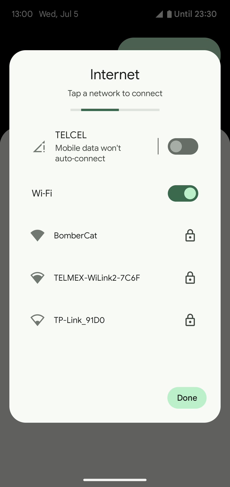
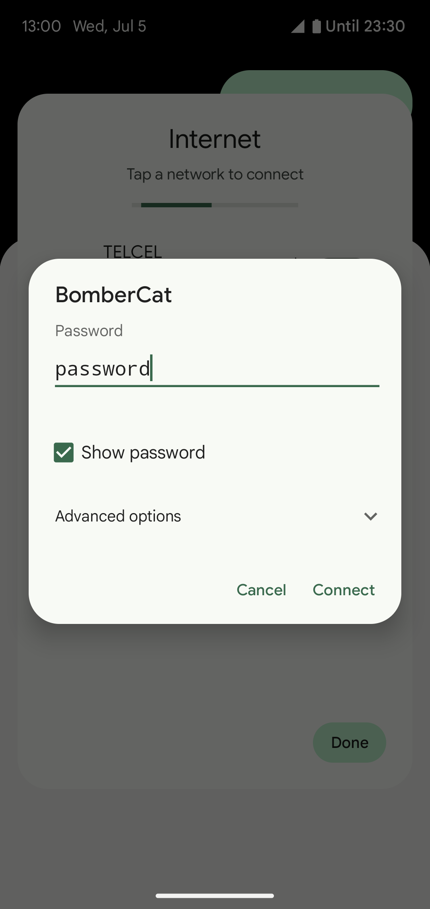
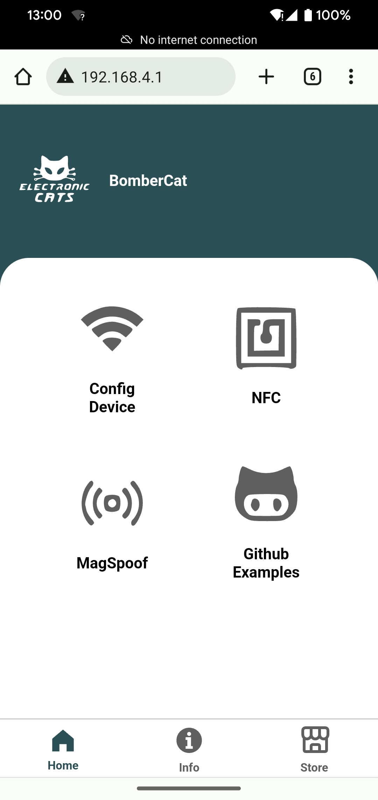

# WiFi web server for BomberCat

Link: https://github.com/ElectronicCats/BomberCat/tree/wifiserver/firmware/WiFiWebServer

Author(s): Francisco Torres

Status: Draft

Last updated: 2023/06/27

## Contents

* Overview
* User guide
* Developer guide

## Overview

This example shows how to use the WiFi module of the BomberCat to create a web server that can be accessed by any device connected to the same network.

### Features

- [x] Web interface.
- [x] MagSpoof (spoof/emulate any magnetic stripe or credit card).
- [x] Read NFC tags.
- [x] Emulate NFC ID.
- [x] Configure the WiFi network name and password.

## User guide

### Hardware required

* BomberCat
* USB-C cable or battery

### Software required

* Web browser

### Setup

1. Connect your BomberCat to your computer using the USB-C cable or a battery and turn it on.
2. Wait for the board to create the WiFi network. You should see something like this:

<p align="center">
	
</p>

3. Connect your device to the BomberCat WiFi network using the password `password`. You can change the WiFi network name and password in the `Device Config` tab of the web interface.

<p align="center">
	
</p>

4. Open a web browser and go to http://192.168.4.1. You should see the web page served by the BomberCat.

<p align="center">
	
</p>

### Common issues

- **Forgot the WiFi password:** Reset the BomberCat by pressing the `reset button`. Once the board is reset, you will have 3 seconds to press the `main button` 3 times to reset the WiFi network name and password to the default values.

## Developer guide

### Hardware required

* BomberCat
* USB-C cable

### Software required

Choose one of the following options:

* [Arduino IDE](https://www.arduino.cc/en/main/software)
* [arduino-cli](https://arduino.github.io/arduino-cli/latest/installation/)

### Libraries required

```
Used library           Version Path

Preferences            2.1.0
SPI
WiFiNINA               1.8.14
Electronic Cats PN7150 1.8.0
Wire
```

Install the WiFiNINA and Electronic Cats PN7150 libraries using the Arduino IDE Library Manager or the arduino-cli command line tool. If you are using the arduino-cli command line tool, you can install the libraries using the following commands:
```
arduino-cli lib install WiFiNINA
arduino-cli lib install 'ElectronicCats PN7150'
```

> Note: Install the Preferences library manually. You can download it from [here](https://github.com/ElectronicCats/Preferences.git).

### Platform required

```
Used platform              Version Path
electroniccats:mbed_rp2040 2.0.0
```

### Setup

1. Connect your BomberCat to your computer using the USB-C cable.
2. Open the `WiFiWebServer.ino` sketch using Arduino IDE or your favorite editor.
3. Select the `BomberCat` board from the Arduino IDE menu.
4. Select the port that corresponds to your board.
5. Compile and upload the sketch.

> Note: you don't need to worry about the web files, they are already included, just upload the `WiFiWebServer.ino` sketch.

### Run

1. Uncomment the line `#define DEBUG` in the `WiFiWebServer.ino` sketch. It's located at the beginning of the file.
```
#define DEBUG
```

2. Open the serial monitor.
3. Wait for the board to create the WiFi network. You should see something like this:
```
Creating access point named: BomberCat
SSID: BomberCat
Password: password
To access the web interface, go to: http://192.168.4.1
Signal strength (RSSI): 0 dBm
```
4. Connect your device to the WiFi network using the password shown in the serial monitor.
5. Copy the IP address shown in the serial monitor.
6. Open a web browser and paste the IP address. You should see the web page served by the BomberCat.
