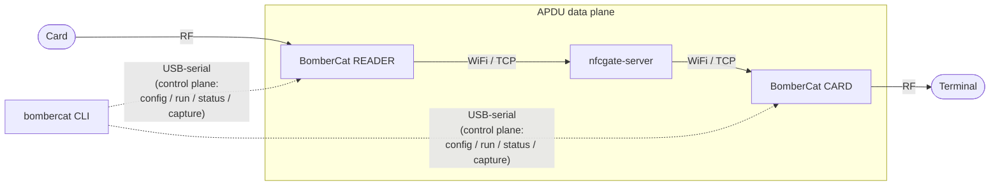

# `bombercat` — control CLI & dev tooling

A `click`/`rich` command-line tool for the NFCGate relay firmware. It talks to a
BomberCat over **USB-serial** to configure it, start/stop the relay, watch it
live and capture the relayed APDUs to Wireshark.

**Control plane only.** No APDUs travel over serial — those go over WiFi/TCP to
the `nfcgate-server`. The USB link is a text, line-based control channel: it
configures, arms, starts, monitors and captures the device, nothing more
(docs/NFCGATE_PLAN.md Fase 6). Keep this in mind everywhere below.



## Install

```sh
cd tools
python3 -m pip install -r requirements.txt   # click, rich, pyserial (+ a few extras)
python3 bombercat.py --help
```

A virtualenv is recommended. On Linux, serial access usually needs your user in
the `dialout` group — see [Troubleshooting](docs/troubleshooting.md#serial-permission-denied).
The tool is developed and tested on Linux; read
[Current limitations](#current-limitations) before running it elsewhere.

Throughout the docs the command is written as `bombercat`; if you have not set up
the [`bombercat` alias](docs/reference.md#invocation) or
[shell completion](docs/reference.md#completion), run it as
`python3 bombercat.py …` from `tools/`.

## Quick start

```sh
# 1. Discover the board(s)
bombercat device list                 # IDs + serial ports; ✓ = answered the handshake
bombercat device info                 # firmware version + current config

# 2. Configure (persisted to flash unless --no-save)
bombercat config wifi    --ssid MyNet --pass 's3cret'
bombercat config nfcgate --server 192.168.1.5:5566 --session 42 --role reader
bombercat config show

# 3. Run & watch
bombercat run                         # associate WiFi, connect server, start relay
bombercat status                      # state / link / peer / relayed count
bombercat monitor                     # live serial stream (relay logs + APDU hex)
bombercat stop

# 4. Capture the relayed APDUs to Wireshark
bombercat capture start -ws           # live Wireshark on a FIFO (Ctrl-C to stop)
```

A relay needs **two** peers on the same `--server` and `--session`: one
`--role reader` (reads a physical card), the other `--role card` (emulates one to
a terminal). Both boards are usually plugged into the same host — address each
one by its ID with `-d/--device`. See the
[end-to-end guide](docs/usage.md).

## Documentation

| Page | What's in it |
|---|---|
| [Command reference](docs/reference.md) | Every command and subcommand: purpose, flags, examples, expected output. `device`, `config`, `run`/`stop`/`status`/`monitor`, `identify`, `capture`, `proto`, `testserver`, `completion`, and device selection with `-d`/`-p`. |
| [End-to-end usage](docs/usage.md) | The real workflow on hardware — two BomberCats via `nfcgate-server` (Path A) and against the NFCGate Android app (Path B) — config → run → monitor → capture. |
| [Control protocol](docs/protocol.md) | The line-based `SerialControl` protocol (`:key value`, `+OK`, `-ERR`), the `DeviceLink` client, and how ports are discovered and numbered. For developers. |
| [Capture / Wireshark](docs/capture.md) | How `capture` taps a copy of every relayed APDU, the classic-pcap vs pcapng distinction, and the `DLT_ISO_14443` encapsulation. |
| [Troubleshooting](docs/troubleshooting.md) | Serial permissions, board not detected, old firmware without `identify`/`capture`, `run` timeouts. |

## Dev tooling

These wrap the reproducible build/test scripts (see docs/NFCGATE_PLAN.md Fases 1–5);
full details in the [reference](docs/reference.md#dev-tooling):

```sh
bombercat proto gen                   # regenerate firmware/core/src/proto/*.pb.{c,h}
bombercat testserver run [-p 5566]    # local nfcgate-server in Docker
bombercat testserver smoke [host port]# relay smoke test (no RF)
```

See [`testserver/README.md`](testserver/README.md) for the local server fixture.

## Tests (dev-only, no hardware)

```sh
python3 tools/tests/serialctl_hosttest.py         # DeviceLink protocol parser (pty)
python3 tools/tests/capture_hosttest.py           # pcap writer + ISO 14443 vs tshark
tools/testserver/codec_hosttest/build_and_run.sh  # firmware codec vs live server
```

## Current limitations

Where the tool stands today (`VERSION` 1.1.0.0) — known constraints, not bugs.

### Platform

Everything here is developed and validated on **Linux**; that is the only OS the
whole tool is exercised on. The control plane is plain `pyserial` with nothing
Linux-specific in it, but several commands shell out to `bash` scripts or to
POSIX-only APIs, so support thins out elsewhere:

| Feature | Linux | macOS | Windows |
|---|---|---|---|
| `device`, `config`, `run`/`stop`/`status`/`monitor` | tested | should work, untested | should work, untested |
| `capture start -o file.pcap` | tested | should work, untested | should work, untested |
| `capture start -ws` (live Wireshark) | tested | FIFO path, untested | needs `pywin32`, untested |
| `completion install` | bash/zsh/fish | bash/zsh/fish | not offered |
| `proto gen` | tested | should work | needs `bash` (WSL / Git Bash) |
| `testserver run` | tested | needs Docker Desktop | needs `bash` + Docker |
| `tools/tests/` host tests | tested | should work | `serialctl_hosttest.py` needs `os.openpty()` |
| `testserver/codec_hosttest` | tested | needs `g++` | needs `bash` + `g++` |

Concretely, the non-Linux gaps are:

- `bombercat completion` is only registered on Linux/macOS
  ([modules/core/cli.py](modules/core/cli.py)); on Windows it is absent from
  `--help` and refuses to install.
- `proto gen` and `testserver run` are wrappers that run `bash gen_proto.sh` /
  `bash testserver/run.sh`, so they need a POSIX shell.
- `testserver run` needs Docker **and** a user who can reach its socket. The
  preflight diagnoses `docker`-group membership through the `grp` module, which
  only exists on Unix; elsewhere it can only report "unknown" and give a generic
  hint.
- The Wireshark launcher knows install paths for Windows/Linux/Darwin only; any
  other OS gets *"We don't support this OS yet"*.
- Serial access on Linux needs the `dialout` group, and the firmware flasher
  ([scripts/flash_bombercat.sh](../scripts/flash_bombercat.sh)) auto-installs
  its dependencies through `apt` — on non-Debian distros you install
  `arduino-cli` yourself.

### Host requirements it cannot work around

- **Live capture needs Wireshark installed locally**, in one of the usual
  install paths or on `PATH`. A flatpak/snap install that exports no `wireshark`
  wrapper is not detected. There is no remote capture (no SSH, no extcap).
- **The pipe name is fixed** (`/tmp/fbombercat`, `\\.\pipe\fbombercat`) with no
  flag to change it, so there can be **only one live capture per host**.
  Capturing both boards live at once collides on that FIFO — capture one side
  with `-o file.pcap` and the other with `-ws`, or do them one after the other.
- **Classic pcap only.** The writer emits classic pcap with `DLT_ISO_14443`; no
  pcapng, no per-packet comments
  ([capture.md](docs/capture.md#classic-pcap-vs-pcapng)).
- `tools/tests/capture_hosttest.py` checks the dissection only when `tshark` is
  installed; without it that half of the test is skipped.
- `testserver smoke` needs the classic protobuf 3.x runtime. If the interpreter
  running the CLI lacks it, a throwaway venv is bootstrapped in
  `tools/.venv-smoke` (same idea as `.venv-proto` for `proto gen`).

### Devices and serial

- **One command per board at a time.** The port is not opened exclusively, so a
  second command against the same board steals bytes from the first — `monitor`
  and `capture start` cannot share one BomberCat. Two *different* boards in
  parallel are fine.
- **`monitor` raises the firmware log level to Debug** while it runs (restored
  on exit), which makes the relay's hot path chattier — worth remembering before
  measuring latency with it open.
- **Device IDs are stable only while the set of attached boards is unchanged.**
  They are derived from the USB iSerial (or the USB topology location) and then
  numbered in order, so plugging in or removing a board renumbers the rest.
  Re-check with `bombercat device list` before reusing a `-d` from an earlier
  session.
- **VID/PID matching is a hint, not proof.** Sketches built against the stock
  Arduino Mbed profile enumerate as `2341:005E`, so a real Arduino Nano RP2040
  Connect on the same host is tagged as a candidate too. Only the ✓ in
  `device list` (the control handshake) confirms a board is a BomberCat.
- **Firmware floors.** `capture` needs firmware ≥ v0.8.0, and `identify` /
  `loglevel` need a recent build; against older firmware those commands fail
  with `-ERR unknown command`
  ([troubleshooting.md](docs/troubleshooting.md#old-firmware-without-identify--capture)).
- **The CLI does not flash firmware.** That is
  [scripts/flash_bombercat.sh](../scripts/flash_bombercat.sh)'s job (`bash` +
  `arduino-cli`).

### Relay scope

- **Exactly two peers per session** — one `--role reader` and one `--role card`,
  sharing a `--server` and a `--session` (1–255). No multi-peer sessions, and no
  more than one relay session per board.
- **`run` has a fixed 45 s bring-up budget**, not adjustable by flag. A timeout
  does not wedge the board: the REPL stays live, so `status`/`monitor` keep
  answering ([troubleshooting.md](docs/troubleshooting.md#run-times-out)).
- **Nothing in the chain is authenticated or encrypted.** The serial control
  channel is plaintext (the WiFi passphrase travels in the clear and is
  persisted to the board's flash unless you pass `--no-save`), and the
  peer↔server link is plain TCP, exactly as upstream NFCGate. Use it on a
  network you control.
- **Path B, variant B1** (BomberCat as `reader` against the NFCGate Android app
  emulating the card) requires a **rooted** phone with Xposed and NFCGate's
  native hook — it is not possible on a stock phone. Variant B2 (BomberCat as
  `card`, phone as reader) works on a stock device. See
  [docs/HARDWARE_TESTING.md](../docs/HARDWARE_TESTING.md).

## Appendix: run the server on a dedicated VPS

`bombercat testserver run` is meant for a **local, ephemeral** server in Docker.
To keep the relay up **permanently** you run `nfcgate-server` on a machine of its
own — a VPS, or a box on your LAN — and point both BomberCats at it. The server
is just a TCP relay: clients join a 1-byte **session** and it forwards every
length-prefixed frame to the other client in that session. No crypto, no app
logic.

```
[ card ] --RF--> [ BomberCat READER ] --WiFi/TCP--\
                                                   >-- nfcgate-server (:5566)
[ terminal ] <--RF-- [ BomberCat CARD ] --WiFi/TCP-/
```

The code is the **`ElectronicCats/nfcgate-server` fork** (branch `v2`) pinned to
commit `fc9103d` — upstream `nfcgate/server@4d32cc1` plus our latency patch. A
fuller Spanish walkthrough lives in `docs/SERVIDOR_DEDICADO_NFCGATE.md`;
this is the condensed English version.

**The whole appendix in one screen:**

```bash
# on the VPS
sudo ufw allow 5566/tcp
curl -fsSL https://get.docker.com | sudo sh
sudo git clone https://github.com/ElectronicCats/nfcgate-server.git /opt/nfcgate-server
cd /opt/nfcgate-server && sudo git checkout fc9103d
# from your machine:  scp tools/testserver/Dockerfile USER@VPS_IP:/opt/nfcgate-server/
sudo docker build -f Dockerfile -t nfcgate-server .
sudo docker run -d --restart unless-stopped --name nfcgate-server \
  -p 5566:5566 --entrypoint python nfcgate-server server.py

# from your machine
bombercat testserver verify VPS_IP 5566     # -> RESULT: PATCH ACTIVE
bombercat testserver smoke  VPS_IP 5566     # -> RELAY SMOKE TEST PASSED
```

### A. The latency patch — already in the pinned commit

Upstream `4d32cc1` as-is costs **~13.5 s per transaction**; with the patch it
drops to **~4.2 s**. It is the single biggest latency cut in the project and it
is **pure server code** — no reflashing the boards. **You no longer apply it by
hand:** the fork's pinned `fc9103d` already contains it, so it arrives with the
clone in step B.3. The same changes stay versioned in this repo:

```
tools/testserver/latency-fixes.patch
```

It touches only `server.py`, in two places:

| Phase | What it does | Gain |
|---|---|---|
| **E** | `TCP_NODELAY` + coalesced write (header+payload in **one** TCP segment) so Nagle/delayed-ACK doesn't stall every server→board relay | ~13.5 s → ~5 s |
| **H** | per-frame logging moved off the hot path (adds `-v/--verbose`, quiet by default) | ~50–150 ms |

Locally `bombercat testserver run` asserts it for you; on the VPS it comes with
the clone. Either way, **verify** it is live — that is section E. You only apply
the patch by hand on a pristine `nfcgate/server@4d32cc1` checkout, or to bring an
older clone up to date.

### B. Deploy with Docker (recommended, from scratch)

1. **Provision the VPS.** Ubuntu 22.04/24.04 LTS, 1 vCPU / 1 GB RAM is plenty.
   Note its **public IP**, admin **user**, and open **TCP 5566** both in the OS
   firewall and in the provider's security group:

   ```bash
   sudo ufw allow 5566/tcp        # or: firewall-cmd --add-port=5566/tcp --permanent && firewall-cmd --reload
   ```

2. **Install Docker** on the VPS (over SSH):

   ```bash
   curl -fsSL https://get.docker.com | sudo sh
   sudo docker run --rm hello-world      # sanity check
   ```

3. **Clone and pin the server** on the VPS:

   ```bash
   sudo git clone https://github.com/ElectronicCats/nfcgate-server.git /opt/nfcgate-server
   cd /opt/nfcgate-server && sudo git checkout fc9103d
   ```

   > `fc9103d` (branch `v2`) is upstream `nfcgate/server@4d32cc1` **plus** the
   > latency patch, so there is nothing to apply afterwards.

4. **Copy this repo's Dockerfile to the VPS.** The `Dockerfile` lives here, not
   in the fork. From **your machine** (a second local terminal):

   ```bash
   scp tools/testserver/Dockerfile USER@VPS_IP:/opt/nfcgate-server/Dockerfile
   ```

   > Bringing an **older** clone up to date instead of re-cloning? Either
   > `sudo git fetch origin && sudo git checkout fc9103d`, or copy the patch over
   > (`scp tools/testserver/latency-fixes.patch USER@VPS_IP:/tmp/`) and run
   > `sudo git apply /tmp/latency-fixes.patch` from `/opt/nfcgate-server`. If
   > `git apply` fails it's almost always because the checkout isn't at `4d32cc1`
   > (`git -C /opt/nfcgate-server rev-parse --short HEAD`) or the patch is already
   > applied — `git apply --check` tells you without touching anything.

5. **Build and run** (the Dockerfile already pins `protobuf==3.20.3`):

   ```bash
   cd /opt/nfcgate-server
   sudo docker build -f Dockerfile -t nfcgate-server .
   sudo docker run -d --restart unless-stopped --name nfcgate-server \
     -p 5566:5566 --entrypoint python nfcgate-server server.py
   ```

   `--restart unless-stopped` survives reboots and SSH logout.

   > **Why `--entrypoint python … server.py`?** The image ends in
   > `ENTRYPOINT ["python", "server.py"]` **plus `CMD ["log"]`**, so a bare
   > `docker run nfcgate-server` does *not* start "with no arguments" — it starts
   > `server.py log`, loading the `log` plugin. That plugin protobuf-decodes and
   > hex-prints **every relayed frame** inside `PluginHandler.filter()`, on the
   > same lock-step hot path Phase H just cleaned up. It is deliberate for the
   > local fixture (it is how `testserver run` shows you APDUs) and wrong for a
   > production relay. Overriding the entrypoint is what actually gets you
   > **no plugins = fast mode**.

   For debugging, relaunch *with* the plugin and verbose logging, then put it
   back when you're done — both cost latency:

   ```bash
   sudo docker rm -f nfcgate-server
   sudo docker run -d --restart unless-stopped --name nfcgate-server \
     -p 5566:5566 nfcgate-server log -v
   sudo docker logs -f nfcgate-server          # decoded APDUs, live
   ```

   > **Re-patching or updating later?** The Dockerfile does `COPY server.py` at
   > *build* time, so `docker restart` does **not** pick up code changes. You must
   > `docker build` again and recreate the container — see section G.

### C. Deploy with systemd (no Docker)

Same code, no container. Isolate the pinned protobuf in a venv:

```bash
cd /opt/nfcgate-server
sudo python3 -m venv .venv
sudo .venv/bin/pip install "protobuf==3.20.3"
```

Create `/etc/systemd/system/nfcgate-server.service`:

```ini
[Unit]
Description=NFCGate relay server (BomberCat)
After=network-online.target
Wants=network-online.target

[Service]
Type=simple
WorkingDirectory=/opt/nfcgate-server
# No plugins and no -v = fast mode. To debug: "server.py log -v", then
# systemctl daemon-reload && systemctl restart nfcgate-server
ExecStart=/opt/nfcgate-server/.venv/bin/python server.py
Restart=always
RestartSec=2
# Optional hardening:
DynamicUser=yes
NoNewPrivileges=yes

[Install]
WantedBy=multi-user.target
```

```bash
sudo systemctl daemon-reload
sudo systemctl enable --now nfcgate-server
sudo journalctl -u nfcgate-server -f    # connections/sessions (APDUs only with 'log -v')
```

Unlike Docker, this path runs `server.py` **straight from the working tree**, so
a `git checkout` followed by `systemctl restart` is enough — nothing is baked in.

> Here `ExecStart` really does take no arguments, so this genuinely is the
> no-plugin fast mode. `server.py` exits cleanly on SIGTERM (what systemd and
> `docker stop` send); on SIGINT (Ctrl-C) upstream throws a traceback, which is
> why running it under systemd or Docker beats running it by hand.

### D. Check the port is reachable

Both boards must reach **TCP 5566** on the server. Three places can block it —
the OS firewall, the provider's security group, and the network path itself:

```bash
# on the VPS: is the server actually listening?
ss -ltn | grep 5566

# from your machine: does the port answer from outside?
nc -vz VPS_IP 5566
```

- On a VPS, opening the OS firewall is **not enough** — open it in the provider's
  security group too.
- The boards are on WiFi. If the server is on another network you need a public
  IP (or a port-forward) reachable from that WiFi, not just from your laptop.
- **No TLS, no auth.** Anyone who reaches the port and guesses the session byte
  is in the relay. Outside a closed lab, put it behind a VPN (WireGuard /
  Tailscale) or restrict the source IPs by firewall.

### E. Verify the patch is actually live

Three independent checks — do at least the first and the third:

```bash
# 1. On disk (VPS): all three must print something
grep -n TCP_NODELAY server.py                  # Phase E
grep -n "int.to_bytes(len(msg), 4" server.py   # Phase E, coalesced write (one line)
python3 server.py --help | grep verbose        # Phase H

# 2. Inside the *running* server, not the file on disk:
sudo docker exec nfcgate-server grep -c TCP_NODELAY /srv/server.py   # Docker: must print 2
systemctl show nfcgate-server -p ExecStart                           # systemd: which file runs?

# 3. On the wire, from your machine, no hardware needed (conclusive):
bombercat testserver verify VPS_IP 5566        # -> RESULT: PATCH ACTIVE
```

Check 2 is the one people skip and the one that bites: with Docker a stale image
keeps serving the old `server.py` even after you patch the file, because the
`COPY` happened at build time. Check 3 measures what the server *does* (frames
arriving in one segment vs two) and also reports the relay round-trip.

### F. Point the boards at it, then run

```bash
# per board, over USB:
bombercat config wifi    --ssid "MyNet" --pass "s3cret"
bombercat config nfcgate --server VPS_IP:5566 --session 42 --role reader   # 'card' on the other
bombercat config show
```

Both boards share the **same `--server` and `--session`** (1–255); only `--role`
differs (`reader` + `card`). Then `bombercat run` / `status` / `monitor` on each,
exactly as in the [end-to-end guide](docs/usage.md). Smoke-test the server with
`bombercat testserver smoke VPS_IP 5566` (relays correctly?) alongside the
`verify` above (fast?).

> **Distance is latency you can't optimize away.** EMV is strict lock-step —
> ~72 one-way board↔server hops per transaction. A VPS ~20 ms away adds ~1.4 s on
> top of the ~4.2 s floor; ~80 ms away adds ~5.8 s. Put the VPS **near** the
> boards, and measure the real RTT from the boards' WiFi with `ping VPS_IP`.

### G. Day 2: update, restart, inspect

To move the server to a newer fork commit:

```bash
cd /opt/nfcgate-server
sudo git fetch origin
sudo git checkout <new-commit>          # or: sudo git checkout v2 && sudo git pull
```

Then make the running process actually pick it up:

```bash
# Docker — rebuild, the restart alone is NOT enough
sudo docker build -f Dockerfile -t nfcgate-server .
sudo docker rm -f nfcgate-server
sudo docker run -d --restart unless-stopped --name nfcgate-server \
  -p 5566:5566 --entrypoint python nfcgate-server server.py

# systemd — runs from the working tree, so a restart is enough
sudo systemctl restart nfcgate-server
```

Re-run section E check 3 (`bombercat testserver verify`) afterwards: it is the
one check that cannot be fooled by a stale image. Everyday operations:

```bash
sudo docker logs -f nfcgate-server   /   sudo journalctl -u nfcgate-server -f
sudo docker stop|start nfcgate-server /  sudo systemctl stop|start nfcgate-server
```

Whenever you change the pinned commit here, update
[`firmware/core/proto/UPSTREAM.md`](../firmware/core/proto/UPSTREAM.md) and
`SERVER_COMMIT` in [`tools/testserver/fetch_server.sh`](testserver/fetch_server.sh)
so local and VPS stay on the same code.

### H. Troubleshooting

| Symptom | Likely cause / check |
|---|---|
| `bombercat run` never reaches `relaying` | Port not reachable (`nc -vz VPS_IP 5566`, section D); board's WiFi can't route to the server; `--session` differs between boards. Confirm what was persisted with `bombercat config show`. |
| Server is up but nothing relays | The two boards must share one session and take **opposite** roles (`reader` + `card`). |
| protobuf traceback on the server | protobuf 4+ is installed; pin `3.20.3` (*"Descriptors cannot be created directly"*). |
| **Works, but ~13 s per transaction** | The classic missing-Phase-E signature. Run `bombercat testserver verify VPS_IP 5566`; if it says `PATCH MISSING`, the running code is unpatched — with Docker, **rebuild** (section G), a restart won't do it. |
| `grep TCP_NODELAY` finds it but it's still slow | You're looking at the file, not the process. Ask inside the container — section E, check 2. |
| Noticeably slower than ~4.5 s **with** the patch live | Distance (`ping VPS_IP` from the boards' network, section F), or you left the server running with `log` / `-v` from a debugging session (section B.5). |
